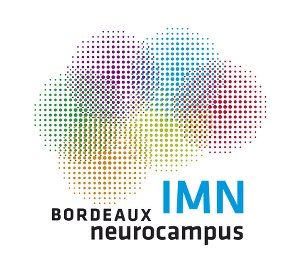

# Computational Neuroscience Crash Course
**Arthur Leblois (CNRS) & Nicolas P. Rougier (Inria)**

Given the increasing complexity of neural data and the generalized use of
theoretical models in neuroscience, more and more neuroscientists rely on
computationnal tools for modelling or data analysis. We would like to offer the
possibility to those who feel that their maths/informatics background is a bit
short to update their maths and to get familiar with basic techniques for data
analysis/modelling. The course will span over two years, with a first part
(2019) focusing on the maths and programming pre-requisites, and a second part
next year (2020) on data analysis (and possibly modelling to follow). The
course is open to everyone (student, post-docs, researchers...) but we'll give
priority to **master and PhD students** given the limited number of
places. Just send us an email to subscribe if you're interested.

For all courses (maths and programming), we'll provide some theoretical
background, provide small exercices for participant to work on their own and
then solve the exercices together and make sure everybody has acquiered the
related concepts and techniques. **Courses will be taught in English.**

## Important dates

Date  | Time | Place | Topic
----- | ---- | ----- | -----
April  5, 2019 | 9:30-11:30 | [ED Building], room 30 | [Linear Algebra](#linear-algebra)
April 12, 2019 | 9:30-11:30 | [ED Building], room 30 | [Differential Equations](#differential-equations)
April 26, 2019 | 9:30-11:30 | [ED Building], room 30 | [Signal Processing](#signal-processing)
July   1, 2019 | 9:00-17:00 | [ED Building], room 30 | [Introduction](#introduction)
July   2, 2019 | 9:00-17:00 | [ED Building], room 30 | Data processing
July   4, 2019 | 9:00-17:00 | [ED Building], room 30 | Signal analysis
July   5, 2019 | 9:00-17:00 | [ED Building], room 30 | Project 

[ED Building]: https://www.openstreetmap.org/#map=19/44.82505/-0.60734

## Program

### Starters

#### Linear Algebra

This course will introduce vectors and matrices, how to peform operations such
as addition & multiplication on these objects and the correspondence with
geometry and the resolution of a system of linear equations. Exercises will be
given for the next lesson.

#### Differential Equations

We'll first correct exercises from the previous lesson then we'll cover
first-order differential equations (that can for example describe the evolution
of a membrane potential). We'll see how to analyze and solve such
equation. Exercises will be given for the next lesson.

#### Signal Processing

We'll first correct exercises from the previous lesson then we'll explain first
what is the Fourier transform that is ubiquituous in signal processing, what is
spectral analysis and how to compute correlation in order to reveal similarity
between signals. Instruction on how to install Python on your machine will be
given.

### Main course

#### Introduction

During this course, we'll first check that everyone has a functional Python
installation with special attention to the Jupyter notebook.  We'll start
programming in Python and review basic types, control flow & functions. We'll
thengive some maths reminder and in the meantime, we'll explain how to apply
them using Python and a dedicated scientific library.

#### Data exploration

We'll introduce the project that students will have to complete by the end of
the week. We'll present additional programming material that will be necessary
to load and visualize the data as well as primitive data curation
techniques. Students will work in pair and will start exploratory data analysis
while tutors will be present the whole afternoon to give feedbacks and help if
necessary. The next goal of the project will be introduced such that students
can work on their own on the next day.

#### Signal processing

We'll briefly introduce the spectral analysis tools available in NumPy, the
scientific library of Python. Students will work in pair and will apply various
spectral analysis tools to the data to determine if and how the spectral
content of the data can be used to classify various data categories. During the
afternoon, students continue working on the project, applying selected spectral
analysis tools to the whole data set and extracting relevant indexes.

#### Project

Based on the analysis performed in the previous lesson, students will finalize
the criteria to classify the data and develop visualization tools to
recapitulate the classification analysis. The classification tools will be
applied to the complete data set to sort the data. Finally, students will have
to write a final report as a clear and heavily commented notebook (based on
your code) that will be exported as a single PDF with text, code, figures and
results.

### Dessert 

Social event (drink) will end the week and the course.
